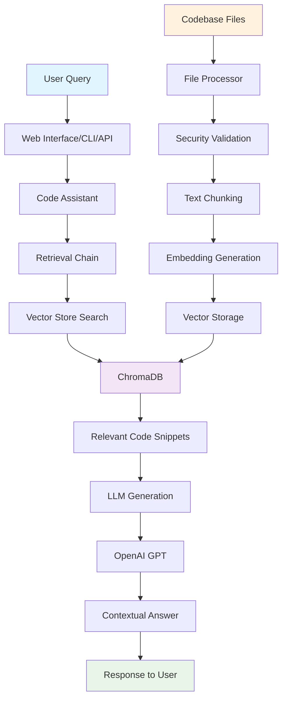

# 🤖 RAG Code Assistant

A powerful Retrieval-Augmented Generation (RAG) system that helps developers understand and work with their codebases using AI. Built with LangChain, OpenAI, and ChromaDB.

## 🚀 Features

- **🔍 Code Embedding**: Automatically processes and embeds your codebase into a vector database
- **💬 Intelligent Queries**: Ask questions about your code and get contextual answers
- **🛡️ Security**: Built-in security guard rails and input validation
- **🌐 Web Interface**: Modern Streamlit-based web UI for easy interaction
- **🔌 REST API**: Full REST API for integration with other tools
- **📊 Conversation Memory**: Maintains context across multiple questions
- **🔧 Multi-language Support**: Supports Python, JavaScript, Java, C/C++, Go, Rust, and more

## 📋 Table of Contents

- [Architecture](#architecture)
- [Installation](#installation)
- [Configuration](#configuration)
- [Usage](#usage)
- [API Reference](#api-reference)
- [Security](#security)
- [Contributing](#contributing)

## 🏗️ Architecture



## 🛠️ Installation

### Prerequisites

- Python 3.8+
- OpenAI API key

### Setup

1. **Clone the repository**
   ```bash
   git clone <repository-url>
   cd LANGCHAIN_RAG_CODE_ASSITANT
   ```

2. **Install dependencies**
   ```bash
   pip install -r requirements.txt
   ```

3. **Set up environment variables**
   ```bash
   cp config.env.example .env
   # Edit .env with your OpenAI API key
   ```

4. **Configure OpenAI API key**
   ```bash
   export OPENAI_API_KEY="your_openai_api_key_here"
   ```

## ⚙️ Configuration

Create a `.env` file with the following variables:

```env
# OpenAI Configuration
OPENAI_API_KEY=your_openai_api_key_here

# Vector Database Configuration
CHROMA_PERSIST_DIRECTORY=./chroma_db

# Application Configuration
DEBUG=True
LOG_LEVEL=INFO

# Security Configuration
MAX_TOKENS=4000
TEMPERATURE=0.7
MODEL_NAME=gpt-3.5-turbo

# File Processing Configuration
MAX_FILE_SIZE=10485760  # 10MB
SUPPORTED_EXTENSIONS=.py,.js,.ts,.java,.cpp,.c,.h,.hpp,.cs,.go,.rs,.php,.rb,.swift,.kt,.scala,.dart,.r,.m,.pl,.sh,.sql,.html,.css,.xml,.json,.yaml,.yml,.md,.txt
```

## 🚀 Usage

### Command Line Interface

1. **Embed a codebase**
   ```bash
   python main.py embed /path/to/your/codebase
   ```

2. **Interactive mode**
   ```bash
   python main.py interactive
   ```

3. **Start API server**
   ```bash
   python main.py serve
   ```

4. **Start web interface**
   ```bash
   python main.py web
   ```

5. **Check system health**
   ```bash
   python main.py health
   ```

### Web Interface

1. Start the API server:
   ```bash
   python main.py serve
   ```

2. Start the web interface:
   ```bash
   python main.py web
   ```

3. Open your browser to `http://localhost:8501`

### API Usage

#### Embed Codebase
```bash
curl -X POST "http://localhost:8000/embed-codebase" \
  -H "Content-Type: application/json" \
  -d '{"directory_path": "/path/to/codebase", "recursive": true}'
```

#### Ask Questions
```bash
curl -X POST "http://localhost:8000/ask" \
  -H "Content-Type: application/json" \
  -d '{"question": "What is the main function in this codebase?"}'
```

#### Get System Info
```bash
curl "http://localhost:8000/system-info"
```

## 📚 Example Questions

- "What is the main function in this codebase?"
- "How is authentication handled?"
- "Show me all the API endpoints"
- "What are the database models?"
- "How is error handling implemented?"
- "Find all functions that use the database"
- "What are the configuration options?"
- "Show me the project structure"

## 🔌 API Reference

### Endpoints

| Method | Endpoint | Description |
|--------|----------|-------------|
| `GET` | `/health` | Health check |
| `POST` | `/embed-codebase` | Embed a codebase |
| `POST` | `/ask` | Ask a question |
| `GET` | `/system-info` | Get system information |
| `GET` | `/conversation-history` | Get conversation history |
| `DELETE` | `/conversation-history` | Clear conversation history |
| `DELETE` | `/vector-store` | Clear vector store |

### Request/Response Models

See `src/api/models.py` for detailed request/response schemas.

## 🛡️ Security Features

### Input Validation
- File size limits (10MB max)
- Supported file extensions only
- Input sanitization for queries
- Harmful keyword detection

### File Processing
- UTF-8 encoding validation
- File integrity checks (SHA-256)
- Secure file reading with error handling
- Directory traversal protection

### API Security
- Request validation with Pydantic
- Error handling without information leakage
- Rate limiting capabilities
- CORS configuration

### Guard Rails
- Maximum token limits
- Temperature controls
- Conversation memory limits
- Vector store size monitoring

## 🏗️ Project Structure

```
LANGCHAIN_RAG_CODE_ASSITANT/
├── src/
│   ├── __init__.py
│   ├── config.py                 # Configuration management
│   │   └── config.py
│   ├── api/
│   │   ├── __init__.py
│   │   ├── models.py             # Pydantic models
│   │   └── routes.py             # FastAPI routes
│   ├── assistant/
│   │   ├── __init__.py
│   │   └── code_assistant.py     # Main assistant logic
│   ├── embeddings/
│   │   ├── __init__.py
│   │   └── embedding_manager.py  # Vector embeddings
│   ├── utils/
│   │   ├── __init__.py
│   │   └── file_processor.py     # File processing utilities
│   └── web/
│       ├── __init__.py
│       └── streamlit_app.py      # Web interface
├── main.py                       # CLI entry point
├── requirements.txt              # Dependencies
├── config.env.example           # Environment template
└── README.md                    # This file
```

## 🔧 Supported File Types

- **Python**: `.py`
- **JavaScript/TypeScript**: `.js`, `.ts`
- **Java**: `.java`
- **C/C++**: `.c`, `.cpp`, `.h`, `.hpp`
- **Go**: `.go`
- **Rust**: `.rs`
- **PHP**: `.php`
- **Ruby**: `.rb`
- **Swift**: `.swift`
- **Kotlin**: `.kt`
- **Scala**: `.scala`
- **Dart**: `.dart`
- **R**: `.r`
- **Objective-C**: `.m`
- **Perl**: `.pl`
- **Shell**: `.sh`
- **SQL**: `.sql`
- **Web**: `.html`, `.css`, `.xml`
- **Data**: `.json`, `.yaml`, `.yml`
- **Documentation**: `.md`, `.txt`

## 🤝 Contributing

1. Fork the repository
2. Create a feature branch
3. Make your changes
4. Add tests if applicable
5. Submit a pull request


---

**Made with ❤️ for developers**
